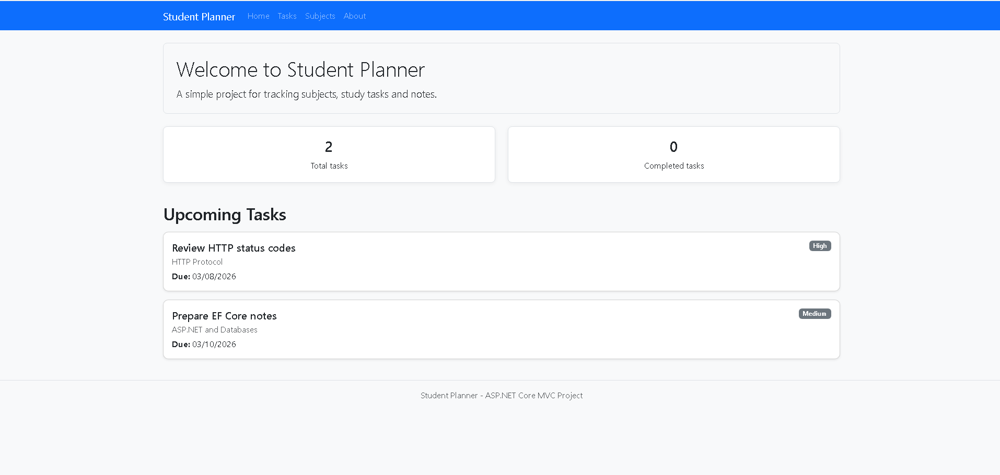
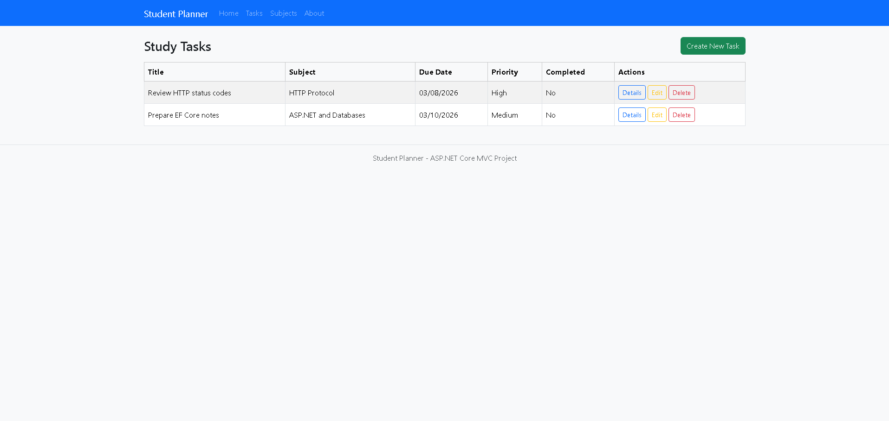
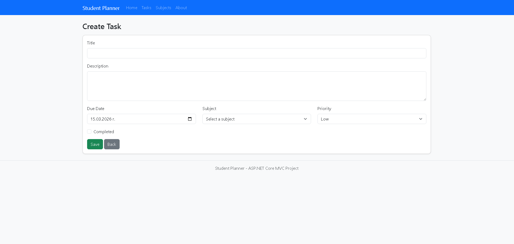
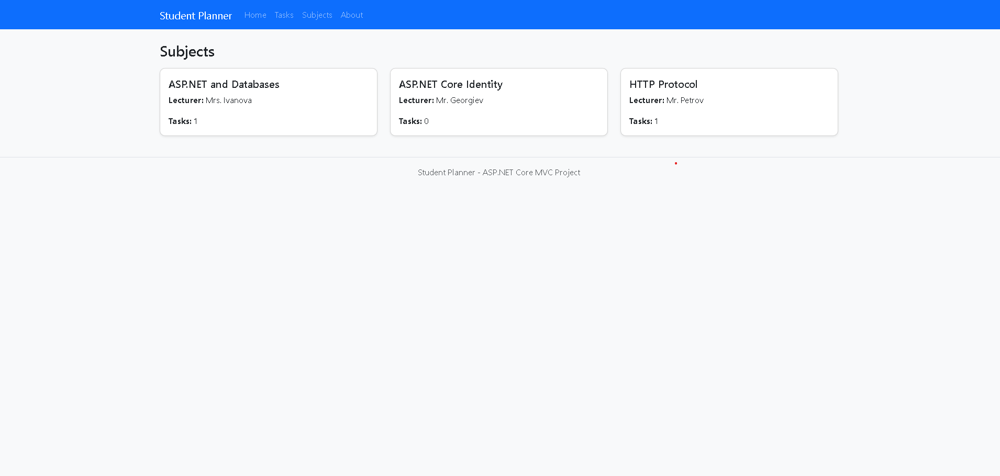

# Student Planner

Student Planner is a small ASP.NET Core MVC app where I keep track of my subjects and study tasks.  
The idea is to have one place where I can see what’s coming up and mark tasks as completed.

## Features
- Task list (Study Tasks)
- Create / Edit / Delete tasks (CRUD)
- Each task is linked to a subject (Subject)
- Priority levels (Low / Medium / High)
- Form validation (required fields, etc.)

## Technologies
- ASP.NET Core MVC (.NET)
- Entity Framework Core
- SQL Server LocalDB

## Running locally
1. Open `StudentPlannerApp.sln` in Visual Studio
2. Run the project (F5)

On the first run, the app creates a LocalDB database and seeds some sample data.

## Screenshots

